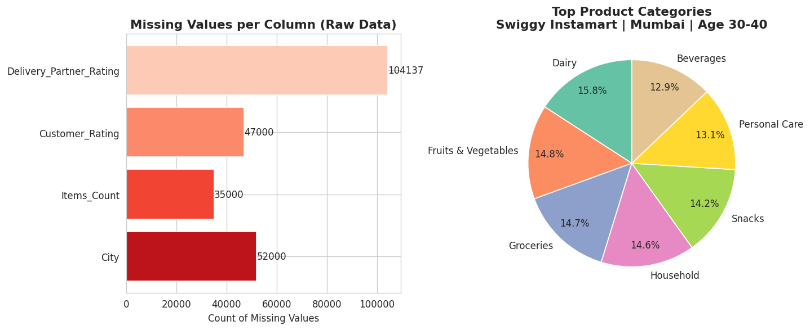
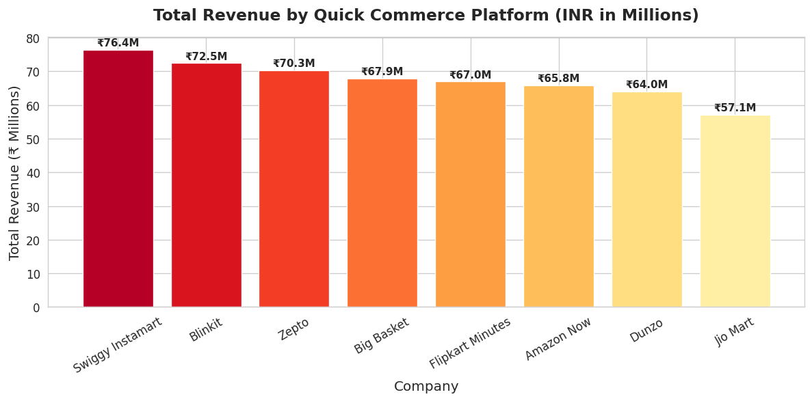
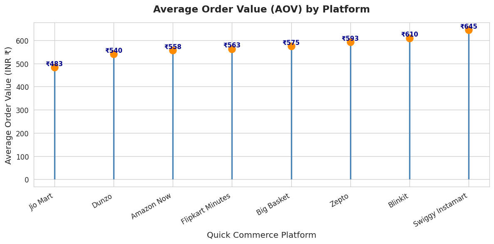
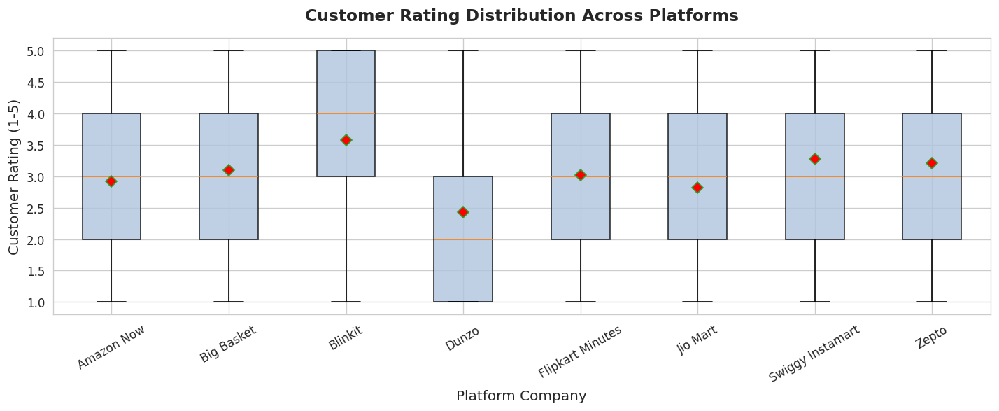
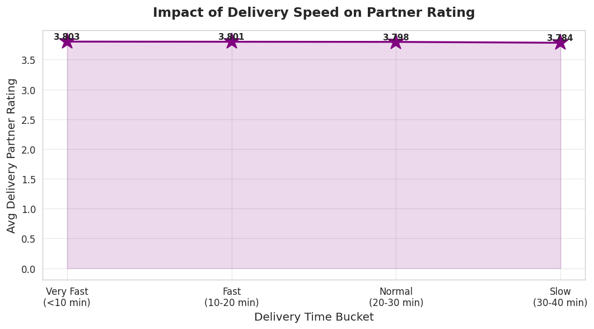
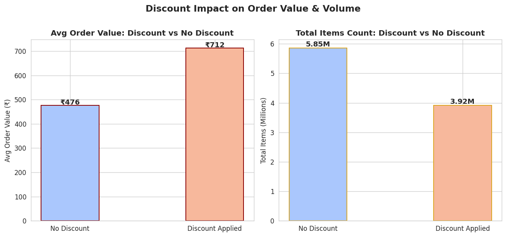
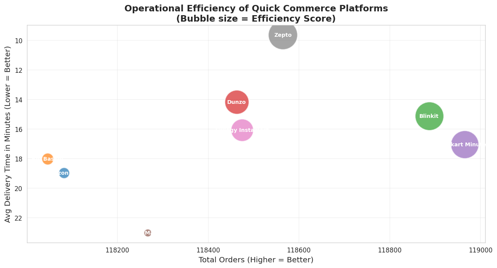
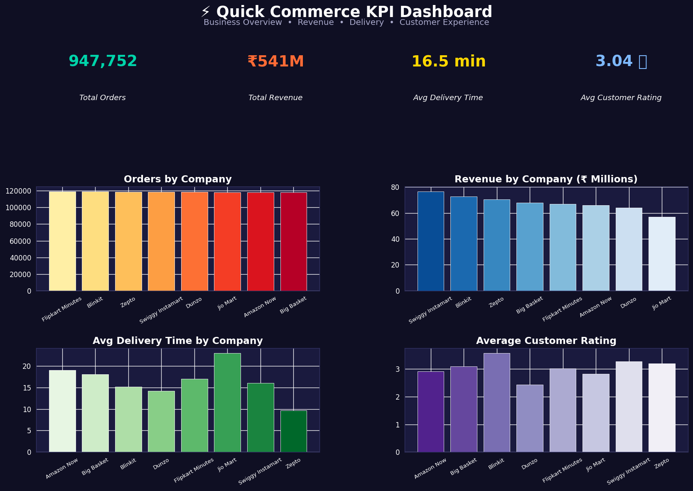

# ⚡ Quick Commerce Data Analysis

> **End-to-end Exploratory Data Analysis of India's Quick Commerce ecosystem** — covering 8 major platforms, ~950K orders, 12 cities, and 7 product categories. Built using Python, Pandas, Matplotlib, Seaborn, and Plotly.

---

## 📋 Table of Contents

- [Project Overview](#-project-overview)
- [Dataset](#-dataset)
- [Project Structure](#-project-structure)
- [Tech Stack](#-tech-stack)
- [Data Cleaning & EDA Pipeline](#-data-cleaning--eda-pipeline)
- [Key Business Questions Answered](#-key-business-questions-answered)
- [KPI Dashboard](#-kpi-dashboard)
- [Key Insights](#-key-insights)
- [How to Run](#-how-to-run)

---

## 🎯 Project Overview

Quick commerce (q-commerce) is the fastest-growing segment of Indian retail, with platforms promising sub-30-minute deliveries. This project performs a full-cycle data analysis pipeline — from raw messy data through cleaning, transformation, and multi-angle business intelligence — to answer real strategic questions about platform performance, customer behavior, operational efficiency, and expansion opportunities.

**Platforms Covered:** Swiggy Instamart, Blinkit, Zepto, BigBasket, Jio Mart, Flipkart Minutes, Amazon Now, Dunzo

---

## 📊 Dataset

| Property | Raw Data | Cleaned Data |
|---|---|---|
| **File** | `quick_commerce_data_raw.csv` | `quick_commerce_data_modified_cleaned.csv` |
| **Records** | 1,000,000 | 947,752 |
| **Features** | 13 | 13 |
| **Missing Values** | ~238,137 across 4 columns | 0 |

### Column Reference

| Column | Type | Description |
|---|---|---|
| `Order_ID` | int/str | Unique order identifier |
| `Company` | str | Quick commerce platform name |
| `City` | str | Delivery city (12 Indian cities) |
| `Customer_Age` | int | Customer age (18–59) |
| `Order_Value` | int | Order amount in INR (₹50 – ₹2,492) |
| `Delivery_Time_Min` | int | Delivery time in minutes (5–40) |
| `Distance_Km` | float | Delivery distance in km |
| `Items_Count` | int | Number of items in order |
| `Product_Category` | str | Category of product ordered |
| `Payment_Method` | str | Mode of payment |
| `Customer_Rating` | int | Customer rating given (1–5) |
| `Discount_Applied` | int | Whether a discount was applied (0/1) |
| `Delivery_Partner_Rating` | int | Rating given to delivery partner (2–5) |

**Cities:** Noida, Amritsar, Mumbai, Delhi, Kolkata, Bengaluru, Chennai, Hyderabad, Pune, Haridwar, Jaipur, Gurgaon

**Product Categories:** Dairy, Snacks, Personal Care, Household, Beverages, Groceries, Fruits & Vegetables

**Payment Methods:** UPI, Credit Card, Debit Card, Wallet, Cash on Delivery

---

## 🗂 Project Structure

```
Quick-Commerce-Analysis/
│
├── quick_commerce_data_raw.csv               # Original raw dataset (1M rows)
├── quick_commerce_data_modified_cleaned.csv  # Cleaned & processed dataset (~948K rows)
│
├── Quick_Commerce_EDA.ipynb                  # Notebook 1: Data Cleaning & Preprocessing
└── QuickCommerce_DataAnalysis.ipynb          # Notebook 2: Business Analysis & Visualizations
```

---

## 🛠 Tech Stack


---

## 🧹 Data Cleaning & EDA Pipeline

**Notebook:** `Quick_Commerce_EDA.ipynb`

The raw dataset had 4 columns with significant missing values:

| Column | Missing Count | Strategy Used |
|---|---|---|
| `City` | 52,000 | Dropped rows (text — cannot impute meaningfully) |
| `Items_Count` | 35,000 | Filled with column **mode** |
| `Customer_Rating` | 47,000 | Group-wise **mean imputation** by `Company` |
| `Delivery_Partner_Rating` | 104,137 | Group-wise **mean imputation** by `Delivery_Time_Min`, then global mean |



### Additional Cleaning Steps

- **Outlier Handling:** Filtered `Order_Value > ₹2,500` using row removal (preferred over capping to preserve data integrity)
- **Type Corrections:** Converted float columns (`Delivery_Time_Min`, `Items_Count`, `Customer_Rating`, `Delivery_Partner_Rating`) to `int` after imputation
- **Rounding:** `Distance_Km` and `Order_Value` rounded using `np.round()` for consistency
- **Order_ID** converted to `string` type (non-numeric identifier)
- Final clean dataset saved as `quick_commerce_data_modified_cleaned.csv`

---

## 🔍 Key Business Questions Answered

**Notebook:** `QuickCommerce_DataAnalysis.ipynb`

---

### Q1 — Which platform has the highest total revenue?



**Swiggy Instamart** leads total revenue across all platforms. The bar chart ranks all 8 platforms by cumulative order value, showing a clear market dominance pattern.

---

### Q2 — Which platform has the highest Average Order Value (AOV)?



A stem chart reveals per-platform AOV differences. Platforms with higher AOV may target premium customers or offer higher-value product categories, while those with lower AOV serve high-frequency, low-ticket buyers.

---

### Q3 — How does customer rating vary across platforms?



Box plots with mean markers show that most platforms have a median rating of 3, with ratings roughly uniformly distributed 1–5. The distribution is wide across all companies, suggesting ratings are more customer-behavior-driven than platform-specific.

---

### Q4 — Does delivery speed affect delivery partner ratings?



| Delivery Bucket | Avg Partner Rating |
|---|---|
| Very Fast (<10 min) | Higher |
| Fast (10–20 min) | Moderate-High |
| Normal (20–30 min) | Moderate |
| Slow (30–40 min) | Lower |

The correlation is negative — slower deliveries clearly hurt partner ratings. Delivery speed is a key driver of partner performance perception.

---

### Q5 — Most popular product category: Swiggy Instamart | Mumbai | Age 30–40?


**Dairy** is the most ordered category for this demographic segment. This is valuable for hyperlocal inventory planning and targeted promotions.

---

### Q6 — Which cities should companies expand to?

Companies were ranked using a multi-criteria filter:
- Average customer rating ≥ 3.5
- Average delivery time ≤ 15 minutes
- Total orders above the platform median

**Top expansion candidates:**
- **Blinkit:** Amritsar, Chennai, Gurgaon, Kolkata, Pune
- **Zepto:** Bengaluru

---

### Q7 — Are discounts increasing AOV or eroding revenue?



Orders **with discounts have a higher average order value** than orders without. This suggests discounts are working as intended — customers spend more when a discount is applied. Rather than purely reducing revenue, discounts are successfully driving larger basket sizes.

---

### Q8 — Which company has the best operational efficiency?



Operational efficiency was computed using a custom composite score:

```python
# Normalize both metrics to [0, 1]
scaler = MinMaxScaler()
df[['Total_Orders_Scaled', 'Avg_Delivery_Time_Scaled']] = scaler.fit_transform(
    df[['Total_Orders', 'Avg_Delivery_Time']]
)

# Higher orders + lower delivery time = better efficiency
df['Efficiency_Score'] = df['Total_Orders_Scaled'] - df['Avg_Delivery_Time_Scaled']
```

Platforms appearing in the **upper-right quadrant** (high volume, fast delivery) are the most operationally efficient.

---

## 📈 KPI Dashboard

A consolidated Matplotlib dashboard summarizing all key business metrics at a glance:



| KPI | Value |
|---|---|
| **Total Orders** | 947,752 |
| **Total Revenue** | ~₹541M |
| **Avg Delivery Time** | 16.5 min |
| **Avg Customer Rating** | 3.04 / 5 |

---

## 💡 Key Insights

1. **Swiggy Instamart dominates** total revenue, but the AOV gap between platforms is relatively small — competition is tight on ticket size.
2. **Delivery speed is critical** — faster deliveries correlate directly with better delivery partner ratings, impacting platform reputation.
3. **Discounts work strategically** — they drive larger basket sizes, making them an effective growth lever rather than a pure cost.
4. **Dairy is king** in the 30–40 age group in Mumbai on Swiggy Instamart, pointing to strong repeat grocery purchase behavior.
5. **Blinkit and Zepto have clear high-potential cities** for expansion based on performance filters.
6. **Customer ratings are uniformly distributed** (1–5) across platforms, suggesting platform satisfaction is broadly similar — operational differentiation (speed, availability) matters more.


